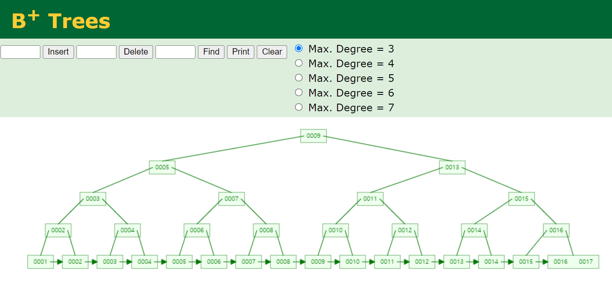
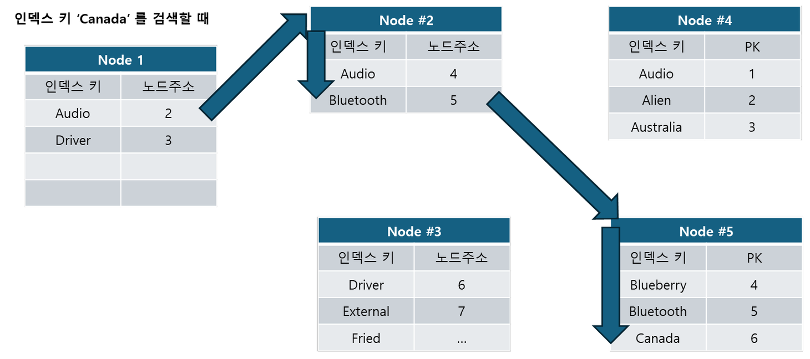

## 메모리 쓰기시 장애를 보완 - WAL

데이터베이스의 데이터는 최종적으로 디스크에 저장됩니다. 디스크는 메모리에 비해 성능이 많이 떨어집니다. 따라서 데이터베이스 성능에 있어서 핵심으로 두는 중점사항은 **"디스크로의 랜덤I/O 를 최소화하는 것"** 입니다. 

디스크 접근에는 순차 I/O 와 랜덤 I/O 가 있습니다. 순차 I/O는 가장 마지막에 읽었던 위치만 알고 있으면 되기에 쓰기 위치를 파악하는데에 있어서 많은 시간이 소요되지 않습니다. 랜덤 I/O 의 경우 원하는 데이터의 위치를 찾은 후 그 위치에 쓰기/수정 작업을 해야 하는데 이때 디스크에 접근하는 비용이 메모리에 접근하는 것에 비해 꽤 큽니다. 

이런 경우 **디스크에 접근하는 횟수를 줄이는 대신 메모리에 캐시 히트율을 높인다면 쓰기에 소요되는 비용이 줄어듭니다.** 하지만 이 경우 메모리의 데이터가 유실될 수 있다는 점 역시 고려해야 합니다. 데이터베이스에 장애가 발생하면, 메모리에 있는 내용들은 디스크에 반영되지 않기에 디스크의 내용과 메모리의 내용이 일치하지 않는 상황이 발생할 수 있습니다. 이런 이유로 대부분의 데이터베이스는 이런 경우에 대비해 `WAL(Write Ahead Log)` 기반으로 동작합니다. 

- [WAL (Write Ahead Log)](https://ko.wikipedia.org/wiki/%EB%A1%9C%EA%B7%B8_%EC%84%A0%ED%96%89_%EA%B8%B0%EC%9E%85)

 

데이터베이스는 쿼리 수행 전에 어떤 쿼리를 사용하는지 실행하려 했던 쿼리들의 기록을 **디스크에 순차기록**을 해둡니다. 따라서 장애 등으로 인해 수행되지 않은 쿼리 들은 이 WAL 이라는 곳에서 읽어서 장애를 복구할 때 WAL에 쌓아둔 실행되지 않는 쿼리를 디스크에 반영합니다. 이렇게 해서 유실될 수 있는 쿼리 요청으로 인해 장애 직전 메모리에 남아있었던 결과와 디스크에 기록된 내용들이 달라질 수 있는 문제로 인한 데이터의 싱크가 깨지는 현상을 해결이 가능합니다. 이렇게 실행하려는 쿼리의 기록을 디스크에 순차 기록을 해두어 데이터의 싱크가 깨지는 현상을 방지하는 기술을 `WAL(Write Ahead Log)` 라고 부릅니다.  

## 저장장치 별 Latency

- [Latency Numbers Every Programmer Should Know](https://colin-scott.github.io/personal_website/research/interactive_latency.html)
- [gist.github.com/jboner/latency.txt](https://gist.github.com/jboner/2841832)

 

## 인덱스

예를 들어 아래와 같은 데이터가 있습니다. 문자`C` 를 찾으려면 끝까지 모두 읽어야 합니다.

| D    |
| ---- |
| Z    |
| B    |
| A    |
| K    |
| C    |

 

이번에는 위의 데이터를 오름차순으로 정렬했습니다. 정렬된 표에서는 `C` 가 3번째에 있다는 사실이 확실하기에 더 빠르게 읽어올 수 있습니다.

| A    |
| ---- |
| B    |
| C    |
| D    |
| K    |
| Z    |

 

### 인덱스를 사용하는 이유

무작위로 데이터의 위치를 O(N)으로 탐색하기 보다는 이렇게 정렬된 자료구조를 통해 데이터를 접근한다면 데이터를 탐색해야 하는 범위가 축소되기에 데이터의 접근 속도가 월등히 빨라지게 됩니다. **즉, 인덱스를 사용하는 이유는 '인덱스의 탐색 범위'를 줄여서 접근 속도를 최적화하기 위해서입니다.** 

### 인덱스 자료구조의 원리

인덱스는 하나의 자료구조입니다. 데이터의 주소들을 특정 순서로 기억하고 있는 하나의 목차와 같은 역할을 합니다. 예를 들어 아래와 같은 테이블이 있습니다. 

| 데이터 주소 | Ticker | 회사명    | 시가총액 |
| ----------- | ------ | --------- | -------- |
| 1           | MSFT   | Microsoft | 3.049 T  |
| 2           | NVDA   | Nvdia     | 1.97 T   |
| 3           | AAPL   | Apple     | 2.818 T  |

 

 

만약 위의 데이터를 시가총액이 가장 낮은 회사를 찾는다거나 시가 총액이 가장 높은 회사를 찾는 다거나 하는 조회를 하려면 아래와 같은 자료구조를 미리 만들어두면 조회 성능상에 이점이 생깁니다.

| 시가총액 | 데이터 주소 |
| -------- | ----------- |
| 1.97 T   | 2           |
| 2.818 T  | 3           |
| 3.049 T  | 1           |

 

만약 시가총액이 가장 낮은 회사를 찾아야 할 경우 가장 맨 처음에 나타난 `1.97T` 에 대한 데이터는 데이터 주소가 2 이고 데이터 주소 2 에 대한 원본 데이터를 확인해보면 `NVDA` 인 것을 확인 가능합니다. 

만약 시가총액이 가장 높은 회사를 찾아야 한다면 가장 마지막에서 첫번째 데이터를 읽으면 되고, `3.049 T` 에 대해 데이터 주소가 1인데 데이터 주소 1에 대한 원본데이터를 확인해서 `MSFT` 라는 것을 확인 가능합니다. 

## B+ Tree - 인덱스의 자료구조

### B+Tree 학습자료

- [https://www.cs.usfca.edu/~galles/visualization/BPlusTree.html](https://www.cs.usfca.edu/~galles/visualization/BPlusTree.html)

 

### 여러가지 자료구조들과의 비교

List

- 정렬되지 않았을 때 : O(n)
- 정렬된 리스트에서는 : O(logN)
- 정렬되지 않은 리스트의 정렬 시간 복잡도는 : 평균 (Mlog(N))
- ArrayList와 같은 구조일 경우 삽입/삭제 시 비용이 높다.

 

HashMap

- 단건 검색 속도 : O(1)
- 범위 탐색 : O(N)
- 전방 일치 탐색 불가 (e.g. like 'AB%')

 

Tree

- 트리의 높이에 따라 시간복잡도가 결정된다.
- 트리의 높이를 최소화 하는 것이 중요
- 한쪽으로 노드가 치우치지 않도록 하는 균형잡힌 트리를 사용
- e.g. Red Black Tree, B+Tree, ...
- Red Black Tree 는 각 노드가 하나의 데이터 역할을 하고, B+Tree 의 각 노드는 리프노드의 주소 역할을 수행

 

### B+Tree

`B+Tree` 는 데이터 자체는 하나의 링크드리스트로 구성되어 있고, 이 링크드 리스트는 트리의 리프로 구성되어 있습니다. 그리고 이 데이터의 주소로 구성된 트리를 이진탐색하면서 원하는 위치를 찾기에, 리프노드에 구성된 링크드 리스트에서 원하는 위치를 빠르게 찾아낼 수 있습니다.

예를 들면 1\~17 까지의 데이터를 추가할 때 아래와 같이 B+Tree 가 생성됩니다. 가장 마지막 리프노드에 `1~17` 데이터가 이어져있고, 각각의 트리는 데이터의 주소를 이진탐색할 수 있도록 구성되어 있음을 확인 가능합니다. 

데이터가 insert 될 때 어떻게 동작하는지는 [https://www.cs.usfca.edu/~galles/visualization/BPlusTree.html](https://www.cs.usfca.edu/~galles/visualization/BPlusTree.html) 에서 확인 가능합니다. 

 

B+Tree 는 기본적으로 아래의 성격을 가집니다.

- 삽입/삭제 시 항상 균형을 유지
- 하나의 노드가 여러개의 자식 노드를 가지는 것 가능
- 리프노드에만 데이터가 존재하기에 연속적인 데이터에 접근 시에 장점을 가짐

 

### mysql 의 B+Tree

mysql의 인덱스는 B+Tree 의 리프노드에 PK를 가지고 있습니다. 참고로 Oracle 에서는 B+Tree 의 리프노드에 데이터의 주소를 가지고 있습니다. 

이렇게 PK를 B+Tree 의 리프노드에 가지고 있는 것은 PK를 클러스터드 인덱스로 가지고 있기에 용이한 구조임을 유추할 수 있습니다. 

아래의 그림은 `Canada` 라는 인덱스 키를 검색할 때 B-Tree 의 주소를 어떻게 검색하는지 절차를 그림으로 그린 것입니다.

 

## 클러스터 인덱스

 

## 커버링 인덱스

 

