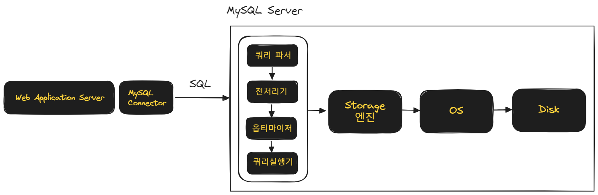
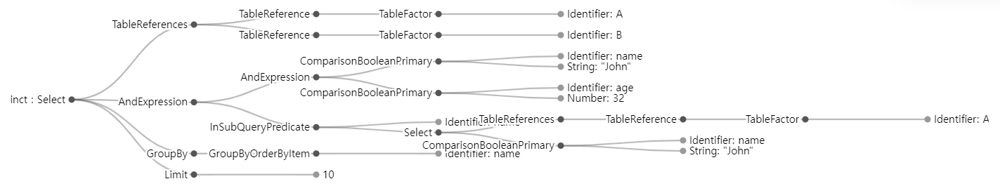

## MySQL 구조




### 쿼리파서

SQL 을 파싱해서 Syntax Tree 를 만듭니다. 이 과정에서 문법 검사가 이뤄집니다.<br/>

마치 javascript 의 정적 페이지를 빌드할 때 linting 등의 밸리데이션 작업을 하듯 이 과정에서 문법검사등을 수행합니다. 문법검사가 끝나면 Syntax Tree 를 만듭니다.<br/>

쿼리 파서가 만들어내는 Syntax Tree 에 대해서는 [https://observablehq.com/@john-guerra/sql-query-visualizer](https://observablehq.com/@john-guerra/sql-query-visualizer)에서 자세히 설명하고 있습니다.<br/>

<br/>


```sql
SELECT distinct * FROM A, B WHERE name="John" and age> 32 
	and name not in (select name  from A where name!= "John") 
	GROUP BY name
	LIMIT 10
```

<br/>


위와 같은 쿼리에 대해서 쿼리 파서는 아래와 같은 Syntax Tree 를 만들어냅니다.




<br/>


### 전처리기

쿼리 파서가 만든 Syntax Tree 를 토대로 전처리를 시작합니다. 테이블,컬럼 존재여부, 접근 권한 등과 같은 Semantic 오류를 검사합니다.<br/>

<br/>


### 옵티마이저

불필요한 조건을 제거하고, 테이블 순서, 통계정보를 바탕으로 전략을 결정합니다. 이 과정을 실행계획 수립이라고 합니다. 쿼리를 처리하기 위한 여러 방법들을 만들고 이 방법들에 대한 비용 정보, 테이블의 통계 정보를 이용해 비용을 산정하는 역할을 수행합니다.<br/>

옵티마이저가 선택하게 되는 전략에 따라 성능이 많이 달라지기도 하는데, 가끔 나쁜 판단이 이뤄질 수도 있어서 개발자가 힌트를 사용하거나 `explain` 명령을 통해 도움을 주기도 합니다.

<br/>


### 쿼리 실행기

옵티마이저가 선택한 전략을 바탕으로 쿼리를 실행하는데, 이때 쿼리 실행기는 `Handler API` 라는 것을 사용해 스토리지 엔진에 요청을 수행합니다.<br/>

<br/>


### 스토리지 엔진

스토리지 엔진은 데이터를 가져오거나 저장하는 역할을 수행합니다. Handler API 에 맞춰서 플러그인 형태로 직접 구현해서 스토리지 엔진에 접근하는 프로그램을 개발하는 것 역시 가능합니다.<br/>

MySQL에는 InnoDB, MyIsam 등 여러 종류의 스토리지 엔진이 존재하는데, 8.0 이후 부터는 InnoDB 엔진이 디폴트 스토리지 엔진이 되었고, 많은 사람들이 MySQL 의 스토리지 엔진을 이야기할 때 대부분 InnoDB 엔진을 이야기합니다.<br/>

InnoDB 엔진은 클러스터 인덱스, Redo-Undo 로그, Buffer pool 등과 같은 특징을 가집니다.<br/>

클러스터 인덱스는 쉽게 말해 인덱스의 데이터 주소가 가까운 곳이 서로 클러스터 처럼 모여있는 것을 의미하는데 인덱스의 리프노드를 PK로 구성하고 인덱스 역시도 PK기반으로 구성되게끔 해서 커버링 인덱스의 성격을 가지게 되어 데이터가 지역성을 갖추게 되어서 데이터의 조회가 효율적으로 이뤄지게 하는 것을 의미합니다.

Redo-Undo 로그 는 MySQL 이 동시성환경에서 MVCC 시에 사용하는 전략을 의미합니다.<br/>

<br/>


