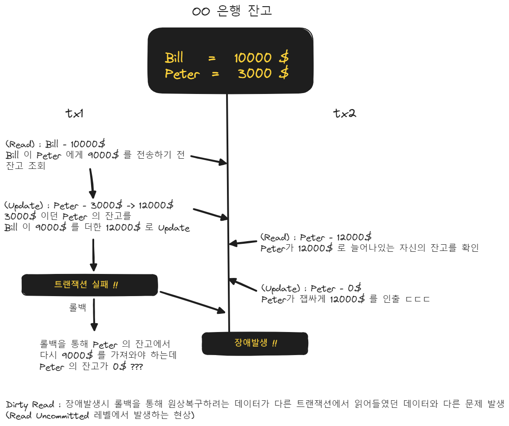

## 트랜잭션 격리수준
트랜잭션의 격리성을 확보할 때 격리 수준을 4가지 단계로 제공할 수 있습니다. 격리수준이 낮은 수준에서 높은 수준으로 나열해보면 아래와 같습니다. 

- `Read Uncommitted` (커밋되지 않은 읽기) : Dirty Read, Non Repeatable Read, Phantom Read 발생
- `Read Committed` (커밋된 읽기) : Non Repeatable Read, Phantom Read 발생
- `Repeatable Read` (반복 가능한 읽기) : Phantom Read 발생
- `Serializable` (직렬화 가능) : 가장 엄격한 격리수준

 

각각의 격리 수준에서 발생하는 나타나는 현상들을 정리하면 아래와 같습니다.

|                   | Dirty Read | Non Repeatable Read | Phantom Read |
| ----------------- | ---------- | ------------------- | ------------ |
| Read Unommitted   | 발생       | 발생                | 발생         |
| Read Committed    |            | 발생                | 발생         |
| Repeatable Read   |            |                     | 발생         |
| Serializable Read |            |                     |              |

 

아래에서부터는 각각의 트랜잭션 격리수준과 발생할 수 있는 현상을 예를 들어 설명합니다. 

 

## Read Uncommitted 
> Dirty Read 가 발생합니다.

커밋되지 않은 것이라도 읽어들일 수 있는 격리 수준입니다. 트랜잭션에서 커밋하지 않은 수정 중인 내용이 다른 트랜잭션에 의해 읽을 수 있는 격리수준으로 가장 낮은 수준의 격리 수준입니다. 만약 다른 트랜잭션으로부터 읽어들인 데이터가 커밋되지 않은 데이터인데 그 데이터가 롤백된다면 데이터의 정합성에 문제가 생깁니다. 

### Dirty Read 현상

트랜잭션 t1 이 데이터를 수정하고 있고 커밋하지 않은 상황에서 트랜잭션 t2 가 t1이 커밋하지 않은 데이터를 읽어들일 수 있는 현상입니다. 만약 트랜잭션 t2가 Dirty Read 한 데이터를 사용하고 있는 중에 t1 이 수정 중인 데이터를 롤백한다면 데이터의 정합성에 문제가 생깁니다. 

은행 송금을 예로 들면 Read Uncommitted 에서 발생할 수 있는 Dirty Read 현상은 아래와 같은 장애를 일으킬 수 있습니다. 

 

## Read Committed 
> Non Repeatable Read 가 발생합니다.

다른 트랜잭션에서 커밋된 데이터를 읽어들일 수 있는 격리수준을 의미합니다. 커밋된 데이터를 읽어들이기에 롤백하지 못한 데이터를 읽게 되는 불상사는 없습니다. 하지만 다른 트랜잭션에서 수정 후 커밋을 한 데이터를 읽어들이기에 조회 작업 도중에 다른 트랜잭션에서 같은 데이터에 대한 수정본 커밋을 한다면 수정본이 읽히는 현상인 Non Repeatable Read 현상이 발생합니다. 

### Non Repeatable Read 현상

은행 송금을 예로 들면 Read Committed 에서 발생할 수 있는 Non Repeatable Read 현상은 아래와 같은 상황이 발생합니다.

 

## Repeatable Read
> Phantom Read 가 발생합니다.

Repeatable Read 격리 수준은 Read Committed 가 보장하지 못하는 수정/커밋 된 데이터에 대해 Repeatable Read 가 가능하도록 하는 격리 수준입니다. Repeatable Read 는 다른 트랜잭션에서 수정/커밋 했어도 한번 조회했던 데이터를 조회하면 그 데이터에 대해서는 같은 데이터가 조회됨을 보장합니다. 

하지만 새롭게 추가된 데이터가 있을 경우에는 반복 조회 시에 같은 결과 값을 조회할 수 있음을 보장하지 못합니다. 

이런 현상을 새롭게 추가된 한 행을 유령(Phantom) 으로 비유하는 Phantom Read 현상이라고 이야기합니다. 

### Phantom Read 

Repeatable Read 는 하나의 트랜잭션에서 데이터를 반복 조회할 때 다른 트랜잭션에서 수정/추가 한 데이터로 인해 새로 추가된(Phantom) 데이터가 보이는 현상을 의미합니다.

 

## Serializable 
가장 엄격한 격리수준이지만, 동시성 성능이 급격히 저하될 가능성이 높습니다.

 

