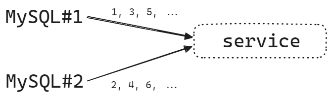
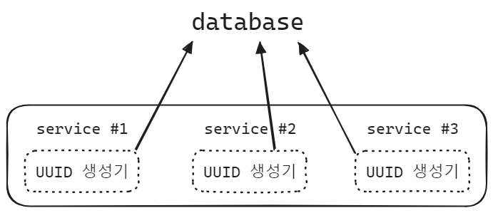
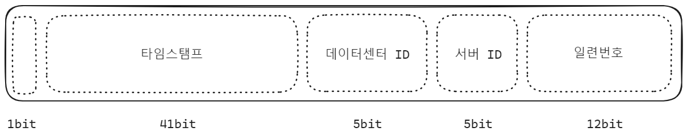

## 분산시스템에서의 유일키 발급 방식 설계 

분산시스템에서 여러개의 서비스가 하나의 데이터베이스에서 auto increment 를 통해 채번을 할 경우 여러 서비스에서 동시에 Database 의 채번기능을 이용합니다. 이 경우 Database 에 부하가 심해집니다. 

이번 글에서는 분산시스템에서 유일키를 발급하는 여러 방식을 살펴봅니다. 여러 서비스에서 각각의 서비스가 유일키를 방식한다면, 데이터베이스에 무리를 덜 주면서도 중복되지 않는 유일키를 발급하는 것이 가능해집니다. 

분산시스템은 꼭 필요한 것이 아닙니다. 분산시스템까지 필요가 없다면, 부하가 크지 않다면 Rate Limiter 를 잘 구현해서 유입량을 조절하는 방식으로 적용 가능합니다. 이 때 Rate Limiter 는 어느 언어에서든 개발이 가능하며, 스프링 프레임워크에서는 Gateway 에서 Rate Limiter 를 지원합니다. 비용을 아낄 수 있다면 가장 좋은 선택이 될 것 같습니다. 

이번 글에서는 모든 트래픽을 받아야만 하는 경우에 대해 분산시스템이 존재할 경우 분산시스템에서 각각의 서비스가 유일키 발급하면서 발급 순서를 유지할 수 있는 방식을 정리합니다. 

유일키 발급 시스템을 잘 이용하면 여러 개의 요청이 동시에 몰렸을 때, 이 것을 Write Behind 방식으로 요청의 대기열을 만들어서 처리할 때 각각의 요청을 유일키를 발급해서 처리하는 것이 가능해집니다. 예를 들면 쿠폰이나 티켓을 발급하는 경우를 예로 들 수 있습니다. 

또는 채팅과 같은 시스템을 개발할 때, 시간 순으로 데이터를 정렬해서 가져와야 하는 경우가 있습니다. 이런 경우에도 유일키 발급 시스템을 따로 구축한다면 좋을 수 있습니다.  

각자 시스템에 맞는 유일키를 발급해서 Redis 등과 같은 캐시 내의 Set, List 에 쌓아서 메시지 대기열을 구현해서 대용량 트래픽을 처리하는 것이 가능합니다.  

유일키 발급 방식의 제일 유명한 사례는 트위터의 스노우 플레이크 방식 입니다. 스노우플레이크 의 방식을 꼭 따르지 않아도 되고 `시간(정수 또는 문자열)+상품코드+별도의 데이터 Range` 와 같은 방식으로 유일키를 생성해낼 수도 있고 여러가지 상황에 맞춰서 유일키 기반으로 동시성 처리를 하는 것이 가능합니다. 아마도 유일키 기반 작업 대기열 처리 방식은 실무에서도 실제로 많이 쓰이는 방식일 것으로 보입니다.  

이번 문서에서는 Snowflake 는 뭔지를 가장 마지막에 알아보고, 유일키 발급 시스템을 구축할 때 어떤 내용들을 고민하게 되는지를 정리해봅니다. 

 

## 참고자료

- [Snowflake ID - wikipedia.org](https://en.wikipedia.org/wiki/Snowflake_ID)
- [트위터의 스노우 플레이크](https://www.google.com/search?q=%ED%8A%B8%EC%9C%84%ED%84%B0+%EC%8A%A4%EB%85%B8%EC%9A%B0%ED%94%8C%EB%A0%88%EC%9D%B4%ED%81%AC&oq=%ED%8A%B8%EC%9C%84%ED%84%B0+%EC%8A%A4%EB%85%B8%EC%9A%B0%ED%94%8C%EB%A0%88%EC%9D%B4%ED%81%AC&gs_lcrp=EgZjaHJvbWUyCQgAEEUYORiABDIKCAEQABiABBiiBDIICAIQABgIGB7SAQg2ODY5ajBqN6gCALACAA&sourceid=chrome&ie=UTF-8)
- [가상 면접 사례로 배우는 대규모 시스템 설계](https://product.kyobobook.co.kr/detail/S000001033116)

 

## 전제조건

만약 아래의 전제조건이 있을 때를 가정해보겠습니다.

- ID 는 유일해야 한다.
- ID 는 숫자로만 구성되어야 한다.
- ID 는 64 비트로 표현될 수 있다.
- ID 는 발급날짜 순으로 정렬 가능해야 한다.
- 초당 10000 개의 ID 를 만들수 있어야 한다.

- 분산 시스템에서 적용 가능해야 한다.

 

## 가능한 방법들

분산시스템에서는 불가능

- 티켓 서버 (Ticket Server) 
  - `auto increment` 를 사용하는 단일 Database 를 사용하는 방식이며, Database 가 SPOF (Single-Point-Of-Failure) 에 빠질수 있습니다. 
  - 분산시스템까지는 필요하지 않거나 비용 문제로 트래픽을 많이 받을 필요가 없다면 앞단에 Gateway 등을 두어서 Rate Limiter 를 적용해서 유입량을 조절하는 방식으로도 우회가 가능하다면, 이 방식을 사용하는 것이 권장됩니다.

 

분산시스템에서 고려 가능한 방식

- 다중 마스터 기반 유일키 발급
- UUID (Universally Unique Identifier)
- 트위터 스노우 플레이크 (twitter snowflak) 접근 방식

 

## 1\. 다중 마스터 기반 유일키 발급

여러 개의 데이터베이스로부터 채번을 하는 방식입니다. 위의 그림에서 `MySQL#1` 은 홀수 키를 발급하고, `MySQL#2` 는 짝수 키를 발급합니다. 

이 방식은 아래와 같은 단점들이 있습니다.

- 여러 데이터 센터에 걸쳐 규모를 늘리기 쉽지 않다
- ID 의 유일성은 보장되지만 그 값이 시간흐름에 맞춰서 커지는지 여부는 보장하기 어렵다.
- 서버를 추가하거나 삭제할 때 잘 동작할지 보장하기 어렵다.

 

## 2\. UUID (Universally Unique Identifier)

- [UUID - ko.wikipedia.org](https://ko.wikipedia.org/wiki/%EB%B2%94%EC%9A%A9_%EA%B3%A0%EC%9C%A0_%EC%8B%9D%EB%B3%84%EC%9E%90)

UUID 는 유일성이 보장되는 키를 표현하는 방식입니다. 128 비트의 문자 또는 숫자로 구별되고, UUID 는 충돌 가능성이 굉장히 낮습니다. 

UUID 는 중복된 UUID 가 생길 확률을 50%로 끌어올리려면 초당 10개의 UUID 를 86년 동안 계속해서 생성해야 합니다. ([UUID - ko.wikipedia.org](https://ko.wikipedia.org/wiki/%EB%B2%94%EC%9A%A9_%EA%B3%A0%EC%9C%A0_%EC%8B%9D%EB%B3%84%EC%9E%90) 내의 Collisions 절 참고)

 

다만 UUID 의 경우 숫자형식이 아니고 문자가 섞여있는 방식이기에 발급 순서별로 정렬하는 것은 쉽지 않다는 점을 인지해야 합니다. 

 

## 3\. 스노우 플레이크 방식 유일키 발급

트위터에서는 스노우플레이크(snowflake) 라는 방식의 ID 생성기법을 사용합니다. 트위터에서 고안했다고 해서 뭔가 거창해보이지만, 이 글을 읽는 독자분들도 여러분들의 시스템에 맞는 유일키 조합을 만들어낼 수 있습니다. 스노우 플레이크에 꼭 맞도록 끼워맞춰서 실무에 도입할 필요까지는 없습니다. 스노우플레이크 방식의 유일키 생성 방식은 아이디어로만 참고하셔도 됩니다. 

스노우플레이크 방식의 유일키는 아래아 같은 형식을 갖습니다.

 

스노우플레이크 방식은 128 bit 의 자리를 갖습니다.

- 1bit (사인(sign) 비트) : 1bit 의 자리를 가지며, 음수, 양수를 구별하기 위해 비워둡니다.
- 41 bit (타임스탬프) : 41 bit 의 자리를 가집니다. 기원 시각(epoch) 이후로 몇 밀리초가 지났는지를 의미하는 값 입니다.
- 5 bit (데이터센터 ID) : 5 bit 의 자리를 가집니다. 2^5 = 32 이므로 32개의 데이터센터를 지칭할 수 있습니다.
- 5 bit (서버 ID) : 5 bit 의 자리를 가집니다. 데이터센터 당 32 개의 할당할 수 있습니다.
- 12bit (일련번호) : 위에서 언급한 각종 번호들 외에도 일련번호를 지정해줍니다. ID 생성시 마다 일련번호가 1 씩 증가합니다. 그리고 1ms 뒤에는 다시 0 으로 초기화합니다. 즉, 밀리세컨드 안에서 몇번째 요청인지를 식별하는 일련번호 입니다.

 

데이터 센터 ID 에 대해 서버 ID에 대해 생성된 키 값과 타임스탬프를 조합하기에 동일 시간에 발생한 타임스탬프에 대해 여러개의 서버에서 발생한 고유한 요청들을 식별할 수 있게 되며, 1ms 내에 발생한 요청들을 데이터센터 ID, 서버 ID 별로 구별할 수 있기 때문에 유일함을 보장 가능합니다. 

이렇게 생성한 유일키는 동시성 처리 시 Write Behind 방식으로 Request 대기열을 쌓아둘 때 각각의 Request 를 유일하게 식별할 수 있다는 점에서 유용합니다. 

 

